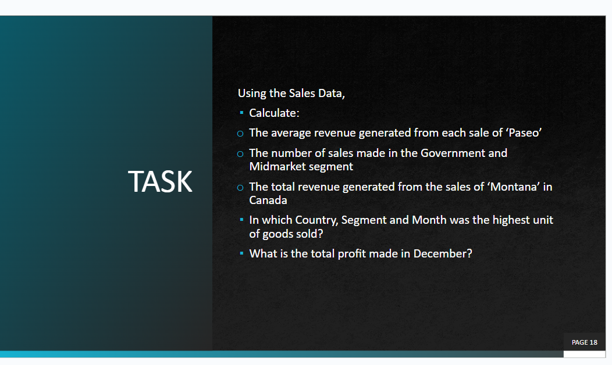
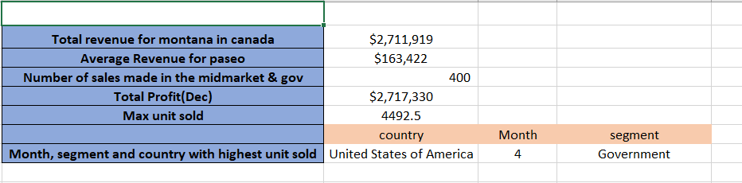
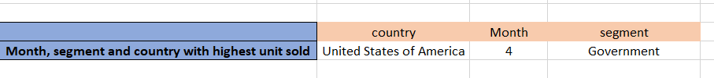

# Sales-data-partial-Analysis

### This is a sales data partially analysed by me for a class task ,few insights was retrived for the purporse of testing out my understanding and ability to use advanced functions in excel. Deep analysis wasnt performed so theres no much insights discovered.

### DATA SOURCES

This is an dummy dataset for a company that does not exist, gotten online and used for practice purposes.

_Disclaimer : This report does not in any way represent any institution or company_.
---
### TOOLS
- EXCEL: DATA Cleaning and analysis.

### DATA PREPARATION
I performed the following in the d

1. data loading
2. inspection and handling missing values
3. Data cleaning and formatting.

### Task question

## RESULTS

1.To get the total revenua for the sales of product montana in canada, which showed that the total sales was $2,711,919. i used **=SUMIFS(B2:B701,D2:D701,"Canada",L2:L701,"montana")**.

2. To find the average revenue for the product paseo i used  **=AVERAGEIF(L2:L701,"paseo",B2:B701)**
  
3. To find the number of sales made in the MIDMARKET AND GOVERNMENT SEGMENTS, i used the countif(**=COUNTIF( O2:O701, "midmarket") + COUNTIF( O2:O701, "government")** ) function to count the total sales made in each of the segments.

4. I used the sumif(**=SUMIF(J2:J701,"December",M2:M701)** ) function to sum the total profit made in December which is $2,717,330.

6. To find the country, month and segment where the highest sales was made, i first used **=max(A2:A701)** To get the highest unit sold, Then i used vlookup **( =VLOOKUP(S6,A2:O701,4,FALSE) , =VLOOKUP(S6,A2:O701,11,FALSE) , =VLOOKUP(S6,A2:O701,15,FALSE)**) to get the corresponding values.

## CONCLUSION

Given that this is not a proper analysis, not much insight was shown and so no recommendation can be given based on this alone. To get more insights for bussiness questions to be answered, further and proper analysis should be carried out.

## THANK YOU. 😄

